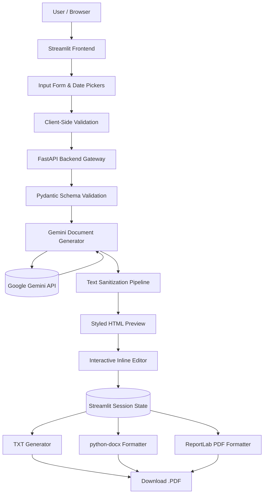

# LEGALEASE AI
### *AI-Powered Legal Document Generator*

[](https://www.python.org/)
[](https://fastapi.tiangolo.com/)
[](https://streamlit.io/)
[](https://ai.google.dev/)
[](tests/)

---

## 1. Project Overview
**LegalEase AI** is a state-of-the-art Generative AI application engineered to simplify, automate, and democratize the creation of legal documents. By translating plain-language user requirements into structured, comprehensive, and legally sound agreements, LegalEase bridges the gap between legal complexity and user accessibility.

Whether drafting employment contracts, lease agreements, non-disclosure agreements, or freelance service contracts, LegalEase AI produces customized, professional drafts with auto-generated terms tables, inline editing, and multi-format exports in **TXT**, **DOCX**, and **PDF**.

---

## 2. Problem Statement
Drafting legal agreements has traditionally been:
- **Costly**: Professional legal consultations for standard agreement drafts are prohibitively expensive for startups, freelancers, and small businesses.
- **Complex & Opaque**: Archaic legal jargon and convoluted formatting make standard templates difficult to interpret and modify safely.
- **Error-Prone**: Static, generic online templates frequently fail to account for specific payment schedules, custom notice periods, or unique obligations, leading to ambiguities.

---

## 3. The LegalEase Solution
LegalEase AI provides an intuitive, full-stack platform where users simply select a contract category, declare participating stakeholders, input key terms (using intuitive semicolon separation), and specify milestone dates. 

The platform's Google Gemini-powered engine synthesizes these specifications into a formal agreement featuring standard preambles, recitals, numbered clauses, terms tables, and execution blocks. Users can preview their draft in an elegant interface, make inline modifications, and export ready-to-use documents in `.docx`, `.pdf`, or `.txt`.

---

## 4. Key Features
- **Comprehensive Document Library**: Built-in support for 8+ contract categories:
  - Employment Contracts
  - Residential & Commercial Lease Agreements
  - Non-Disclosure Agreements (NDAs)
  - Service Agreements
  - Partnership Agreements
  - Sales & Purchase Agreements
  - Freelance Work Contracts
  - General Agreements
- **Intelligent Gemini AI Core**: High-fidelity prompt engineering ensures formal legal structure while preventing legal hallucinations or fabricated citations.
- **Automatic Schedule A Terms Table**: Automatically transforms semicolon-separated clauses into an organized terms schedule.
- **Live Inline Document Editor**: Modify text directly in the browser and save changes to update previews and downloads without re-querying the AI.
- **Custom Branding & Logos**: Upload an organization logo to brand Word and PDF exports, with fallback to default LegalEase branding.
- **Multi-Format Document Pipeline**:
  - **.TXT**: Clean UTF-8 formatted text.
  - **.DOCX**: Microsoft Word output formatted in Times New Roman with styled headings, terms tables, signature sections, and footers.
  - **.PDF**: High-resolution print-ready PDF generated via ReportLab with running headers, footers, and page numbers ("Page X of Y").
- **Prominent Legal Safeguards**: Explicit disclaimers highlighting that generated drafts are for review and require qualification by legal counsel.

---

## 5. System Architecture



---

## 6. Technology Stack

| Layer | Technologies |
| :--- | :--- |
| **Frontend** | Streamlit, HTML5, Custom CSS, Requests, Base64 |
| **Backend** | FastAPI, Uvicorn, Pydantic V2, python-dotenv |
| **AI Engine** | Google Gemini (SDKs: `google-genai` & `google-generativeai`) |
| **Document Formats** | `python-docx` (Word), `reportlab` (PDF), UTF-8 text (TXT), `Pillow` (Images) |
| **Testing** | `pytest`, `httpx`, `unittest.mock` |

---

## 7. Project Structure

```text
LegalEase-AI/
│
├── frontend/
│   ├── __init__.py
│   ├── app.py                      # Streamlit application entrypoint
│   │
│   ├── components/
│   │   ├── __init__.py
│   │   ├── input_form.py           # Form inputs, date pickers, branding uploader
│   │   ├── preview.py              # HTML preview card & inline editor
│   │   └── download_buttons.py     # Binary download streams (TXT, DOCX, PDF)
│   │
│   ├── utils/
│   │   ├── __init__.py
│   │   └── api_client.py           # HTTP client communicating with FastAPI
│   │
│   └── styles/
│       └── custom.css              # Custom styling & dark-theme preview rules
│
├── backend/
│   ├── __init__.py
│   ├── main.py                     # FastAPI app factory & middleware
│   ├── config.py                   # Central settings & constants
│   │
│   ├── api/
│   │   ├── __init__.py
│   │   ├── routes.py               # /generate endpoint
│   │   └── health.py               # / and /health verification endpoints
│   │
│   ├── models/
│   │   ├── __init__.py
│   │   └── schemas.py              # Pydantic validation schemas
│   │
│   ├── ai_core/
│   │   ├── __init__.py
│   │   └── gemini_generator.py     # Google Gemini SDK orchestration & prompts
│   │
│   ├── services/
│   │   ├── __init__.py
│   │   ├── document_service.py     # Unified document generation service
│   │   ├── txt_generator.py        # Plain text formatter
│   │   ├── docx_generator.py       # python-docx Word formatter
│   │   └── pdf_generator.py        # ReportLab PDF formatter
│   │
│   └── utils/
│       ├── __init__.py
│       ├── validation.py           # Domain validation rules
│       ├── sanitization.py         # Text sanitization & terms parsing
│       └── error_handler.py        # Safe custom exception handlers
│
├── assets/
│   ├── logo.png                    # LegalEase logo
│   └── fonts/                      # Font directory
│
├── tests/
│   ├── __init__.py
│   ├── test_health.py              # Health and root endpoint tests
│   ├── test_generate.py            # POST /generate endpoint tests
│   ├── test_validation.py          # Input & date validation tests
│   └── test_document_generation.py # TXT, DOCX, PDF, preview & sanitization tests
│
├── docs/
│   ├── WORKFLOW.md                 # Complete workflow documentation
│   ├── SYSTEM_ARCHITECTURE.md      # Architecture, data flow & Mermaid diagrams
│   ├── FRONTEND.md                 # Streamlit UI, preview & state documentation
│   ├── BACKEND.md                  # FastAPI, routing, services & schema docs
│   ├── API_GATEWAY.md              # REST API endpoint reference & examples
│   ├── AI_INTEGRATION.md           # Gemini prompt engineering & sanitization
│   ├── CORE_FUNCTIONALITIES.md     # In-depth breakdown of features
│   ├── DEVELOPMENT_SETUP.md        # Step-by-step setup for Windows / Antigravity
│   ├── DEPLOYMENT.md               # Local verification & production hosting
│   ├── TESTING.md                  # Test specifications & test run reports
│   └── CONCLUSION.md               # Project conclusion, limitations & roadmap
│
├── .env.example                    # Environment variables template
├── .gitignore                      # Git exclusion rules
├── requirements.txt                # Production & test dependencies
├── README.md                       # Master project documentation
└── run_project.bat                 # Windows one-click batch launcher
```

---

## 8. Prerequisites & Installation

### Prerequisites
- Python 3.10 or higher (Tested on Python 3.14.6)
- Git & PowerShell (on Windows)

### 1. Clone & Set Up Virtual Environment
```powershell
cd C:\Users\DELL\.gemini\antigravity\scratch\LegalEase-AI
python -m venv venv
venv\Scripts\activate
```

### 2. Install Dependencies
```powershell
python -m pip install --upgrade pip
pip install -r requirements.txt
```

---

## 9. Environment Configuration
Copy the template `.env.example` file to `.env`:
```powershell
copy .env.example .env
```
Edit `.env` and add your Google Gemini API key:
```env
# Google Gemini API Key (from https://aistudio.google.com/)
GEMINI_API_KEY=your_gemini_api_key_here

# Supported Model Identifier
GEMINI_MODEL=gemini-2.5-flash

# Backend Network Settings
BACKEND_HOST=0.0.0.0
BACKEND_PORT=8000
BACKEND_URL=http://localhost:8000
```

---

## 10. Running the Application

### Option A: Quick Windows Launcher
Simply run:
```powershell
.\run_project.bat
```

### Option B: Manual Execution

#### Terminal 1 — Start FastAPI Backend:
```powershell
venv\Scripts\activate
uvicorn backend.main:app --reload --port 8000
```
- API Root: `http://localhost:8000/`
- Interactive Swagger UI: `http://localhost:8000/docs`

#### Terminal 2 — Start Streamlit Frontend:
```powershell
venv\Scripts\activate
streamlit run frontend/app.py
```
- Web Application: `http://localhost:8501`

---

## 11. API Endpoints

### 1. `GET /`
Verifies backend connectivity.
```json
{
  "message": "LegalEase AI API is running"
}
```

### 2. `GET /health`
Returns system status, active model, and API key configuration flag.
```json
{
  "status": "healthy",
  "model_configured": "gemini-2.5-flash",
  "api_key_configured": true
}
```

### 3. `POST /generate`
Accepts contract parameters and returns a complete legal draft.

**Sample Request**:
```json
{
  "document_type": "Employment Contract",
  "parties": "Employer: ABC Corp\nEmployee: Jane Doe",
  "terms": [
    "Compensation: ₹50,000 per month",
    "Notice period: 30 days",
    "Confidentiality required"
  ],
  "agreement_date": "2026-10-03",
  "effective_date": "2026-10-05",
  "start_date": "2026-10-05",
  "end_date": "2027-10-04"
}
```

**Sample Response**:
```json
{
  "success": true,
  "document_type": "Employment Contract",
  "content": "# EMPLOYMENT CONTRACT\n\nThis Agreement is entered into...",
  "error": null,
  "terms_count": 3
}
```

---

## 12. Automated Testing
Run the comprehensive test suite:
```powershell
pytest -v
```

**Results**: All 19 test cases passing cleanly across API routes, validation, mock AI generation, and multi-format exports.

---

## 13. Security & Data Protection
- **No Hard-Coded Secrets**: API credentials are read dynamically from `.env` and excluded from version control via `.gitignore`.
- **Safe Error Propagation**: Unhandled exceptions are intercepted by global handlers to prevent leaking stack traces or internal server paths.
- **Upload Validation**: Image uploads are verified via Pillow for type, integrity, and a strict 5MB size limit.

---

## 14. Legal Disclaimer
```text
AI-generated document for drafting purposes only.
This application does not provide legal advice.
Review the generated document with a qualified legal professional before signing or using it.
```
LegalEase AI is an assistive drafting technology. It does not replace legal counsel, nor does it guarantee compliance across all global jurisdictions.

---

## 15. License
Developed for educational, commercial drafting assistance, and software demonstration purposes. All rights reserved.
