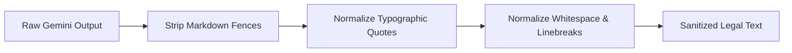

# LegalEase AI - Artificial Intelligence Integration

## Overview
**LegalEase AI** leverages Google's state-of-the-art **Gemini** generative models to transform basic contract parameters into professionally drafted, comprehensive, and legally styled agreements. The integration is encapsulated in `backend/ai_core/gemini_generator.py`.

---

## 1. Supported SDKs & Model Configuration

LegalEase AI dynamically supports both the modern Google GenAI SDK and the legacy Generative AI library:
- **Primary SDK**: `google-genai` (`from google import genai`)
- **Fallback SDK**: `google-generativeai` (`import google.generativeai as genai`)

### Dynamic Model Selection
To ensure long-term resilience against model deprecations, model selection is configured via an environment variable:
```env
GEMINI_MODEL=gemini-2.5-flash
```
If the requested model encounters an endpoint error, the engine automatically attempts fallback across:
1. Configured Model (`GEMINI_MODEL`)
2. `gemini-2.5-flash`
3. `gemini-1.5-flash`
4. `gemini-1.5-pro`

---

## 2. Gemini Prompt Architecture

To ensure high-quality drafting, prevent legal hallucinations, and preserve formal contract structure, `GeminiDocumentGenerator.build_prompt()` follows a structured prompt template:

```text
You are an expert legal document drafting assistant.
Your task is to generate a comprehensive, professional, structured legal document DRAFT titled "{document_type}".

### CRITICAL DRAFTING INSTRUCTIONS:
1. PURPOSE: Generate a formal legal agreement draft based strictly on the user-provided parties, terms, and dates.
2. ACCURACY: Do not invent false factual claims or fabricate specific statutory citations, court names, or case precedents.
3. PLACEHOLDERS: Where necessary legal details (such as specific governing state/jurisdiction or registered entity addresses) are omitted by the user, insert clear bracketed placeholders such as [State/Jurisdiction] or [Registered Business Address].
4. STRUCTURE: Follow standard formal contract conventions:
   - Full Document Title
   - Execution Date & Preamble / Effective Date
   - Parties Identification Clause (stating names, roles, and definitions)
   - Recitals / Whereas Clauses (background and intent)
   - Numbered Substantive Clauses (Definitions, Scope, Payment, Term, Confidentiality, IP, Liability, Governing Law, General Provisions)
   - Formal Signature Block with lines for signatures, printed names, titles, and dates.
5. INTEGRATION OF KEY TERMS: Incorporate every user-specified term accurately.
6. TONE & JARGON: Formal, precise legal drafting English.
7. OUTPUT FORMAT: Clean plaintext with standard headings and paragraph breaks. Do NOT enclose inside markdown backtick fences.
```

---

## 3. Response Sanitization Pipeline

LLM outputs often contain artifacts that interfere with DOCX and PDF document layout engines. Every response passes through `backend/utils/sanitization.py`:



- **Markdown Fence Removal**: Removes leading ` ```markdown ` and trailing ` ``` ` delimiters.
- **Typographic Quote Normalization**: Converts non-ASCII curly quotes (`“`, `”`, `‘`, `’`) to standard characters (`"`, `'`) to prevent font encoding glitches in PDF generators.
- **Whitespace Regularization**: Trims duplicate blank lines while preserving paragraph spacing.
- **Entity Escaping**: Ensures safe rendering in HTML previews and ReportLab flowable paragraphs.

---

## 4. Error Handling & Edge Cases

The AI generator intercepts and translates upstream failures into descriptive, user-friendly errors:

| Scenario | Handled By | User-Facing Message |
| :--- | :--- | :--- |
| Missing API Key | `MissingAPIKeyError` | "Google Gemini API key is missing. Please set GEMINI_API_KEY in your .env file." |
| Invalid API Key | `GeminiAPIError` | "The provided Gemini API key is invalid or unauthorized. Please check your GEMINI_API_KEY." |
| Quota / Rate Limit | `GeminiAPIError` | "Gemini API rate limit or quota exceeded. Please wait a moment or check your API quota." |
| Network / Timeout | `requests.exceptions.Timeout` | "The AI document generation request timed out after 60 seconds. Please try again." |
