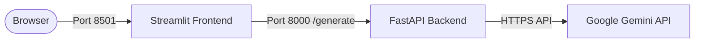

# LegalEase AI - Deployment Guide

## Overview
This document outlines deployment configurations for LegalEase AI, detailing local development deployment as well as production hosting strategies for cloud platforms.

---

## 1. Verified Local Deployment
LegalEase AI has been tested and verified locally on Windows using Python 3.14.6:



### Verified Local Endpoints:
- **Frontend URL**: `http://localhost:8501`
- **Backend URL**: `http://localhost:8000`
- **Swagger Documentation**: `http://localhost:8000/docs`
- **Health Check**: `http://localhost:8000/health`

---

## 2. Production Architecture Considerations

When transitioning LegalEase AI from local execution to production, observe the following architectural recommendations:

### Security Hardening
- **Environment Isolation**: Set `GEMINI_API_KEY` via container secrets or secret managers (e.g. AWS Secrets Manager, GCP Secret Manager, Vault).
- **CORS Restricting**: Restrict `allow_origins` in `backend/main.py` from `["*"]` to the exact production frontend domain (e.g. `["https://app.legalease.ai"]`).
- **Rate Limiting**: Attach middleware (e.g. `slowapi`) to prevent API abuse on `/generate`.
- **Request Size Limiting**: Enforce a maximum payload limit (e.g. 500KB) to prevent resource exhaustion.

### Performance & Scaling
- **ASGI Concurrency**: Run Uvicorn with multiple worker processes behind a reverse proxy:
  ```bash
  gunicorn backend.main:app -w 4 -k uvicorn.workers.UvicornWorker --bind 0.0.0.0:8000
  ```
- **Reverse Proxy**: Deploy Nginx or Cloudflare in front of the application for SSL/TLS termination, HTTP/2 multiplexing, and static caching.
- **Statelessness**: The backend is completely stateless; requests can be load-balanced horizontally across multiple instances or containers.

---

## 3. Cloud Deployment Options

The system can be deployed to modern cloud hosting platforms:

### Option A: Streamlit Community Cloud (Frontend) + Render / Railway (Backend)
- **Frontend**: Deploy the repository to [Streamlit Community Cloud](https://share.streamlit.io/). Set the repository root to `frontend/app.py` and define `BACKEND_URL` in Streamlit secrets.
- **Backend**: Deploy the repository as a Python Web Service on [Render](https://render.com) or [Railway](https://railway.app). Set the start command to:
  ```bash
  uvicorn backend.main:app --host 0.0.0.0 --port $PORT
  ```
  Set `GEMINI_API_KEY` in environment variables.

### Option B: Dockerized Container Deployment (Fly.io / Google Cloud Run / AWS ECS)
Create a production `Dockerfile`:
```dockerfile
FROM python:3.11-slim

WORKDIR /app
COPY requirements.txt .
RUN pip install --no-cache-dir -r requirements.txt

COPY . .

EXPOSE 8000
CMD ["uvicorn", "backend.main:app", "--host", "0.0.0.0", "--port", "8000"]
```

> **Note**: While cloud deployment strategies are documented above for future reference, current active verification has been completed for local deployment on `localhost:8000` and `localhost:8501`.
