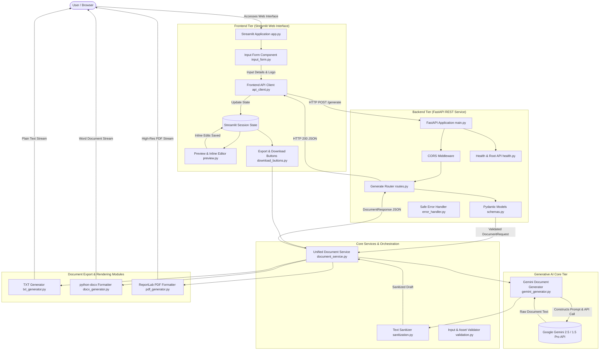

# LegalEase AI - System Architecture

## Architecture Overview

LegalEase AI is architected as a decoupled, multi-tier client-server application adhering to enterprise software design patterns. It separates presentation concerns, API routing, business logic validation, artificial intelligence orchestration, and multi-format binary document rendering into distinct modules.

---

## Architecture Diagram

---

## Architectural Components

### 1. Presentation Tier (Streamlit)
- **Framework**: Streamlit 1.65+
- **Role**: Provides a clean, responsive single-page application for data entry, progress feedback, dark-mode document previews, inline editing, and binary file downloads.
- **State Management**: Uses `st.session_state` to retain generated agreements, edited drafts, parsed terms, and uploaded branding across UI re-renders.

### 2. API Gateway Tier (FastAPI)
- **Framework**: FastAPI with Starlette and Uvicorn
- **Role**: Exposes stateless REST endpoints (`GET /`, `GET /health`, `POST /generate`).
- **Validation**: Enforces strict typing, string length, and semantic date ordering using Pydantic V2 models.
- **Security & Error Handling**: Intercepts unhandled exceptions with global handlers to prevent exposure of internal stack traces, system paths, or credential strings.

### 3. Artificial Intelligence Tier (Google Gemini)
- **Engine**: Google Gemini API via official SDK (`google-genai` and `google-generativeai`).
- **Model**: Defaulting to `gemini-2.5-flash` with seamless fallback to `gemini-1.5-pro` or `gemini-1.5-flash`.
- **Prompt Engineering**: Enforces legal drafting principles, avoids hallucinated statutory citations, generates structured contractual provisions, and places bracketed placeholders for omitted jurisdiction-specific items.

### 4. Text Processing & Sanitization Tier
- **Module**: `backend/utils/sanitization.py`
- **Role**: Normalizes typographic quotes, eliminates backtick markdown fencing, cleans irregular unicode characters, and converts semicolon-separated terms into structured key-value pairs for the Terms Table.

### 5. Document Rendering Tier
- **TXT Generator**: Generates clean, UTF-8 encoded plain text agreements.
- **DOCX Generator**: Utilizes `python-docx` to construct Microsoft Word files with Times New Roman typography, embedded company logos, shaded Schedule A tables, and formal signature lines.
- **PDF Generator**: Utilizes `reportlab` with a custom `NumberedCanvas` to draw multi-page headers, footers ("Page X of Y"), legal disclaimers, table borders, and signature boxes.

---

## Security Architecture

1. **Environment Isolation**: API credentials are loaded strictly from `.env` or system environment variables; no secrets are ever committed or hard-coded.
2. **Input Sanitization**: All user inputs undergo length constraints, type checks, and regex sanitization to prevent injection vulnerabilities.
3. **Logo Image Verification**: Uploaded branding files are validated via Pillow's `verify()` against MIME types, file size limits (5MB), and corruption.
4. **Data Privacy**: No user contract data is logged to disk or exposed in server logs.
