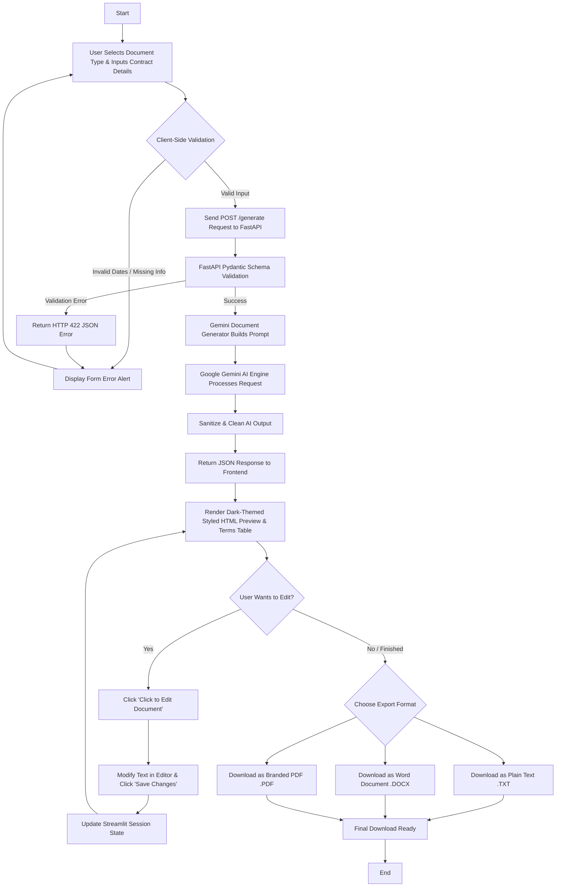

# LegalEase AI - Application Workflow

## Overview
**LegalEase AI** is an AI-powered legal document generation platform that allows users to create legally structured, formatted, and customizable contract drafts in minutes. The complete workflow spans from user input in the Streamlit frontend, Pydantic schema validation, Google Gemini AI drafting, structured sanitization, interactive inline editing, and multi-format document exporting (TXT, DOCX, and PDF).

---

## High-Level Workflow Diagram



---

## Step-by-Step Workflow Breakdown

### 1. Document Configuration
- The user selects a legal document category from a standardized dropdown:
  - Employment Contract
  - Lease Agreement
  - Non-Disclosure Agreement (NDA)
  - Service Agreement
  - Partnership Agreement
  - Sales Agreement
  - Freelance Contract
  - General Agreement
- The user enters stakeholder descriptions (names, roles, addresses, and corporate status).
- The user inputs key contract terms and clauses separated by semicolons (`;`).
- The user selects the Execution Date, Effective Date, and optional Start and End dates using native calendar date pickers.
- Optional: The user uploads a company logo (PNG, JPEG, WebP) for custom branding.

### 2. Client-Side Input Validation
- The Streamlit interface verifies that mandatory fields (document type, parties, terms, agreement date, effective date) are populated.
- Date ranges are validated to guarantee that the contract's term end date does not precede the start date.
- Logo files are inspected for size (<5MB) and validated via Pillow.

### 3. API Communication (REST Gateway)
- Frontend client sends a structured JSON payload to `POST http://localhost:8000/generate`.
- The FastAPI application parses the payload via `DocumentRequest` Pydantic models.
- If invalid or unparseable data is sent, the API returns a descriptive error message with HTTP 422.

### 4. Gemini AI Drafting Engine
- `GeminiDocumentGenerator` constructs an exhaustive, structured prompt enforcing legal conventions:
  - Precise document title
  - Execution date and preambles
  - Recitals and background
  - Numbered substantive clauses (Scope, Payment, Term, Confidentiality, IP, Dispute Resolution, Governing Law)
  - Mandatory signature blocks with signee lines
- Gemini generates the draft while adhering to safety rules: no invented legal authorities, no fabricated statutes, and insertion of clear bracketed placeholders for missing localized information.

### 5. Sanitization & Normalization
- The raw output from Gemini is filtered through `sanitize_text()`:
  - Strips markdown code fence blocks (```` ``` ````).
  - Normalizes unicode curly quotes (`‘`, `’`, `“`, `”`) to standard quotes.
  - Replaces non-breaking and zero-width spaces.
  - Normalizes irregular linebreaks while maintaining legal paragraph structure.

### 6. Interactive Preview & Inline Editing
- The generated legal text is rendered as an elegant dark-mode HTML preview card.
- A **Schedule A: Summary of Agreed Key Terms** table is dynamically generated from the user's semicolon-separated clauses.
- The user can click **Click to Edit Document** to open an inline editor, modify any clause or name, and click **Save Changes**. Changes immediately update the live preview and session state without calling Gemini again.

### 7. Multi-Format Document Export
- The user can download the active agreement at any point:
  - **.TXT**: Clean UTF-8 text file with structured ASCII headers and disclaimers.
  - **.DOCX**: Microsoft Word document formatted in Times New Roman, containing embedded branding logo, styled bold headings, indented clauses, shaded terms table, and professional footer.
  - **.PDF**: High-resolution ReportLab PDF with multi-page header/footer canvas, page numbers ("Page X of Y"), disclaimer, terms table, and formal signature blocks.
